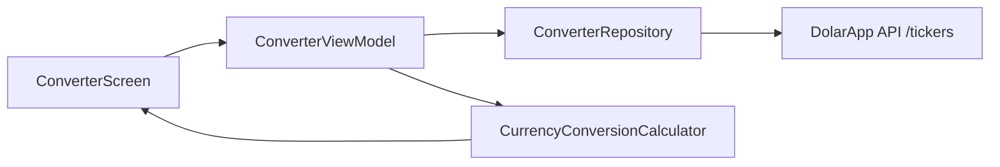

# ArqFinance (CurrencyConverter)

Android app for currency exchange with local authentication, a portfolio home screen, and a live **Exchange Calculator** powered by the [DolarApp API](https://api.dolarapp.dev/v1/).

**Application ID:** `com.arq.currencyconverter`

---

## Tech Stack

| Category | Technology | Version |
|----------|------------|---------|
| Language | Kotlin | 2.4.0 |
| JVM | Java | 17 |
| Android Gradle Plugin (AGP) | `com.android.application` | 9.2.1 |
| Gradle | Wrapper | 9.5.1 |
| UI | Jetpack Compose + Material 3 | BOM 2026.06.00 |
| Architecture | MVVM, feature modules, clean layers | — |
| DI | Hilt + KSP | Hilt 2.59.2, KSP 2.3.5 |
| Navigation | Navigation 3 | 1.1.3 |
| Networking | Retrofit, OkHttp, Gson, kotlinx-serialization | Retrofit 3.0.0 |
| Async | Kotlin Coroutines + Flow | 1.11.0 |
| Local storage | Room, DataStore Preferences | Room 2.8.4 |
| Static analysis | Detekt (+ ktlint wrapper) | 2.0.0-alpha.5 |
| Unit test coverage | Kover | 0.9.8 |
| Unit testing | JUnit 4, MockK, Turbine, coroutines-test | — |
| UI testing | Compose UI Test, Espresso, AndroidX JUnit | — |
| Debug tooling | LeakCanary, Chucker (debug only) | — |
| Desugaring | Core Library Desugaring (`java.time` on API 24+) | 2.1.5 |

**SDK targets:** `minSdk` 24 · `compileSdk` 37 · `targetSdk` 36

Dependencies are centralized in [`gradle/libs.versions.toml`](gradle/libs.versions.toml).

---

## Prerequisites

- **JDK 17** (matches `compileOptions` in `app/build.gradle.kts`)
- **Android SDK** with API 37 platform tools
- An **Android emulator** or physical device (API 24+) for running and UI tests
- (Optional) **Android Studio** — recommended for debugging and Compose previews

---

## Getting Started

Clone the repository and open it in Android Studio, or build from the command line:

```bash
# Windows
gradlew.bat assembleDebug

# macOS / Linux
./gradlew assembleDebug
```

---

## Run the App

### Android Studio

1. Open the project.
2. Select a device or emulator.
3. Run the **app** configuration (▶).

### Command line

Build and install the debug APK on a connected device or emulator:

```bash
# Windows
gradlew.bat installDebug

# macOS / Linux
./gradlew installDebug
```

The launcher activity is `MainActivity`. The app starts at **Sign In**; after authentication you reach **Home**, where **Start New Conversion** opens the Exchange Calculator.

---

## Run Unit Tests

Unit tests live under `app/src/test/` and run on the JVM (no device required).

```bash
# All debug unit tests
gradlew.bat testDebugUnitTest

# macOS / Linux
./gradlew testDebugUnitTest
```

Test report (after a run):

`app/build/reports/tests/testDebugUnitTest/index.html`

Coverage includes ViewModels, repositories, domain logic, network helpers, formatters, and an architecture guard test that enforces **no cross-feature imports**.

---

## Run UI Tests

Instrumented tests live under `app/src/androidTest/` and use Compose UI Test. They require a running emulator or connected device with USB debugging enabled.

```bash
# Install test APK and run all debug instrumented tests
gradlew.bat connectedDebugAndroidTest

# macOS / Linux
./gradlew connectedDebugAndroidTest
```

UI test suites:

| Screen | Test class |
|--------|------------|
| Converter | `ConverterScreenTest` |
| Home | `HomeScreenTest` |
| Sign In | `SigninScreenTest` |
| Sign Up | `SignupScreenTest` |
| Profile | `ProfileScreenTest` |

Report: `app/build/reports/androidTests/connected/debug/index.html`

---

## Unit Test Coverage (Kover)

Kover is applied in `app/build.gradle.kts`. Coverage is collected when unit tests run, then reported separately.

```bash
# 1. Run unit tests (records coverage)
gradlew.bat testDebugUnitTest

# 2. Generate HTML coverage report
gradlew.bat koverHtmlReportDebug

# Optional: print summary to the console
gradlew.bat koverLogDebug

# Optional: XML report (e.g. for CI)
gradlew.bat koverXmlReportDebug
```

**HTML report:** `app/build/reports/kover/htmlDebug/index.html`

**Coverage filters:** Reports intentionally exclude generated/boilerplate code, Hilt/Dagger modules, Room/database implementations, and `@Composable` UI code so metrics focus on business logic. See the `kover { reports { filters { ... } } }` block in `app/build.gradle.kts`.

---

## Project Overview

ArqFinance is a single-module Android app organized by **feature** with shared **core** utilities. Each feature follows **data → domain → UI/ViewModel** layering and registers its own Navigation 3 entry.

### Features

| Feature | Description |
|---------|-------------|
| **Sign In / Sign Up** | Local auth with Room-backed accounts, password hashing, and session persistence via DataStore |
| **Home** | Portfolio-style dashboard with sample balances and entry point to the converter |
| **Converter** | Live USDc ↔ foreign currency calculator (main feature — see below) |
| **Profile** | User profile screen |

### Architecture

```
app/src/main/java/com/arq/currencyconverter/
├── core/           # Shared network, formatting, validation, Room, DataStore
├── di/             # App-wide Hilt modules
├── navigator/      # Navigation 3 back stack, session-aware routing
└── feature/
    ├── converter/  # Exchange calculator
    ├── home/
    ├── profile/
    ├── signin/
    └── signup/
```

- **Hilt** wires dependencies per feature module (`*Module.kt`).
- **Navigation 3** drives screen flow via `AppNavigation` and typed `NavKeys`.
- **SessionObserver** redirects unauthenticated users to Sign In when the session expires.

---

## Main Feature: Exchange Calculator

The Exchange Calculator is implemented in [`ConverterScreen.kt`](app/src/main/java/com/arq/currencyconverter/feature/converter/ui/ConverterScreen.kt) and backed by [`ConverterViewModel`](app/src/main/java/com/arq/currencyconverter/feature/converter/viewmodel/ConverterViewModel.kt).

### What the user sees

- **Title** — “Exchange Calculator”
- **Live rate** — e.g. `1 USDc = 17.25 MXN` plus timestamp; a loading indicator appears for the first emission of each fetch cycle
- **Two currency cards** — source (top) and target (bottom), each with flag, currency code, and amount field
- **Swap button** — flips currencies and amounts between cards
- **Currency picker** — tap the foreign currency row to open a bottom sheet (`CurrencyBottomSheet`) and choose MXN, ARS, BRL, COP, etc.
- **Snackbar** — network or API errors

USDc is fixed on one side; only the **foreign** currency row is tappable.
Polling is lifecycle-aware: when the app goes to background, ticker fetching stops; when it returns to foreground, periodic fetching resumes.

### How it works (data flow)



1. **Startup** — `ConverterViewModel` loads the currency list (`/tickers-currencies`) and requests ticker polling for the current foreign currency every **1 minute** via `ConverterRepositoryImpl.getTickers()`.

2. **Rates** — Each ticker provides **bid** and **ask** prices. The app uses:
   - **BID mode** (default): USDc on top, foreign currency on bottom — rate = `bid`
   - **ASK mode** (after swap): foreign on top, USDc on bottom — rate = `ask`

3. **Typing** — When the user edits an amount, the ViewModel sanitizes input through `CurrencyFormatter`, tracks which field is active (`ActiveInputField`), and runs `CurrencyConversionCalculator.recalculate()` on a background dispatcher:
   - **BID + source active:** `target = source × rate`
   - **BID + target active:** `source = target ÷ rate`
   - **ASK** inverts multiply/divide direction

4. **Done key** — Formats the active field for display and refreshes the rate label.

5. **Swap** — Swaps currency codes, amounts, and toggles BID ↔ ASK so USDc always ends up on the correct side.

6. **Lifecycle control** — `ConverterScreen` observes lifecycle events and forwards:
   - `ON_STOP` → `viewModel.onAppBackgrounded()` (pause polling)
   - `ON_START` → `viewModel.onAppForegrounded()` (resume polling)

7. **Latest-request stream handling** — `ConverterViewModel` combines app foreground state and ticker requests, then uses `flatMapLatest` so only the latest active request can emit into UI state (older streams are cancelled automatically).

8. **Errors** — Failed ticker fetches emit a snackbar message; the rate line shows `—` when no valid rate is available.

### API

Base URL: `https://api.dolarapp.dev/v1/`

| Endpoint | Purpose |
|----------|---------|
| `GET tickers?currencies={code}` | Bid/ask rates for a currency |
| `GET tickers-currencies` | List of supported currency codes |

---

## Other Useful Commands

```bash
# Static analysis (Detekt + ktlint rules)
gradlew.bat detekt

# Build release APK (R8 minification enabled)
gradlew.bat assembleRelease

# Run all verification tasks Gradle groups together
gradlew.bat check
```

Detekt config: [`config/detekt.yml`](config/detekt.yml)

---

## Debug vs Release

| Build | Notes |
|-------|-------|
| **Debug** | LeakCanary enabled; Chucker intercepts HTTP traffic in-app |
| **Release** | R8 full mode + optimization; Chucker no-op; ProGuard rules applied |

---

## Requirements & Permissions

- **Internet** — live exchange rates
- **POST_NOTIFICATIONS** — requested at runtime on Android 13+ (`MainActivity`)

---

## License

No license file is included in this repository. Add one if you plan to distribute or open-source the project.
